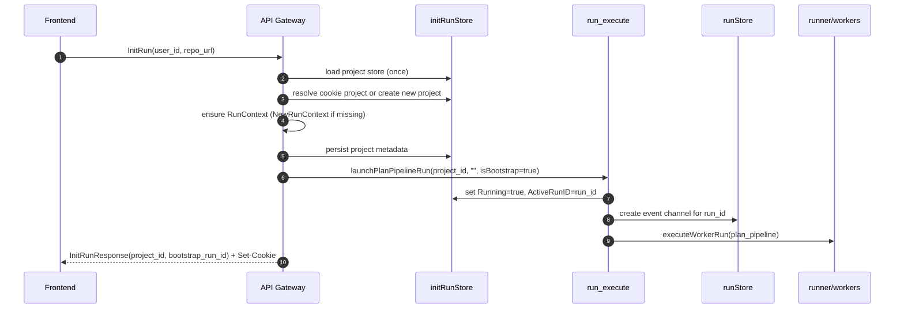
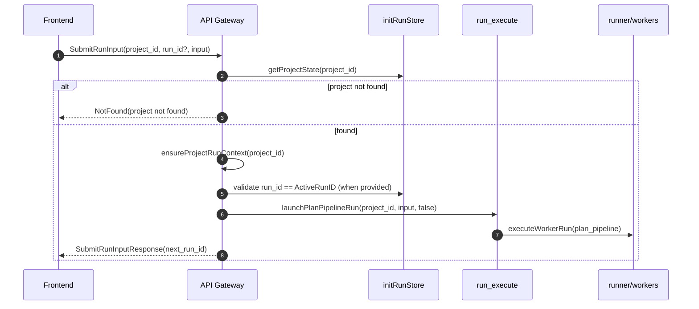
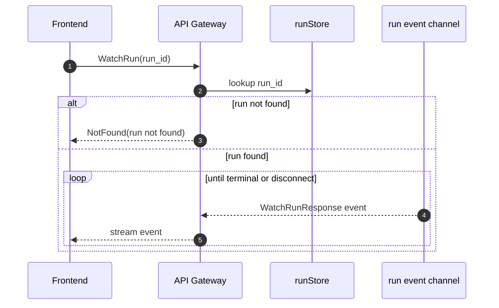
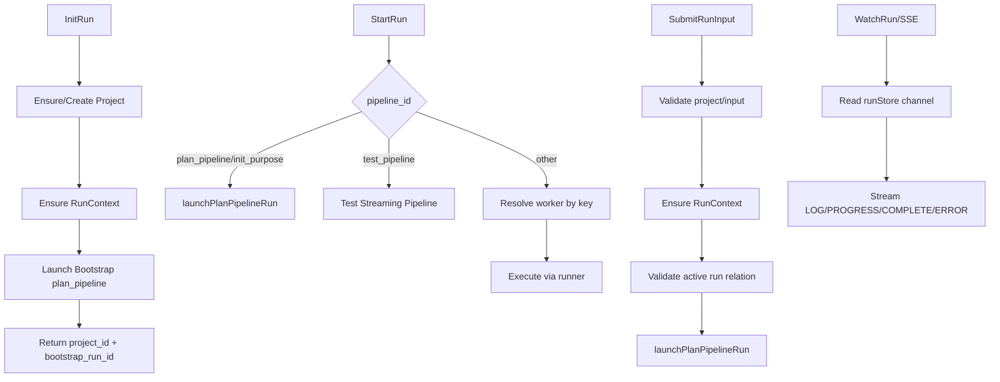

# API Gateway Architecture

This document explains what each `gateway_*.go` file does in `cmd/api`, and how requests flow through the gateway.

## File Responsibilities

- `gateway_contract.go`
  - Compile-time interface conformance: `apiServer` implements `PipelineServiceHandler`.

- `gateway_state.go`
  - Shared in-memory gateway state.
  - `runStore`: `run_id -> event channel` for `WatchRun`.
  - `initRunStore`: `project_id -> initProject` for project and run context tracking.
  - `scheduleRunCleanup`: delayed cleanup of completed runs from `runStore`.

- `gateway_project_state_store.go`
  - Project state persistence and helper accessors.
  - JSON persistence file: `tmp/project_states.json`.
  - Helpers: `getProjectState`, `putProjectState`, `updateProjectState`, `ensureProjectRunContext`.
  - Central place for project load/save and safe updates.

- `gateway_project.go`
  - Project state utility functions.
  - `inferRepoName`: normalize repo name from URL.
  - `resolveProjectID` and `resolveProjectIDFromCookieHeader`: project resolution from request/cookie.

- `gateway_run_context.go`
  - Run execution environment creation.
  - `RunContext` definition and `NewRunContext`.
  - Builds LLM client, filesystem sandbox wrappers, MCP registry, and merged worker resolver.

- `gateway_run_execute.go`
  - Generic worker launch and execution pipeline.
  - `launchWorkerRun`: allocates run ID, marks project running, creates event channel.
  - `executeWorkerRun`: resolves worker, executes via runner, emits events.
  - `bridgeRunnerEvents`: maps internal runner events to API stream events.
  - `updateProjectStateFromResult`: writes back purpose/repo updates from `plan.BootstrapOut`.
  - `launchPlanPipelineRun`: convenience wrapper for `plan_pipeline`.

- `gateway_init.go`
  - `InitRun` endpoint implementation.
  - Resolves/creates project, ensures run context, persists project, starts bootstrap run, sets project cookie.

- `gateway_start.go`
  - `StartRun` endpoint implementation.
  - Handles:
    - `plan_pipeline` / `init_purpose` via `launchPlanPipelineRun`.
    - `test_pipeline` streaming demo path.
    - generic worker execution path with `runner.ExecuteWorkerWithResult`.

- `gateway_submit.go`
  - `SubmitRunInput` endpoint implementation.
  - Validates `project_id`, `run_id`, and `input`.
  - Ensures project run context.
  - Validates active run consistency.
  - Launches `plan_pipeline` continuation run.

- `gateway_watch.go`
  - Streaming endpoints:
    - `WatchRun` (Connect stream RPC)
    - `handleWatchSSE` (SSE fallback endpoint)
  - Reads from `runStore` event channel and streams until terminal event or disconnect.

## Core Runtime Model

Gateway runtime state is split into two maps:

- `projectStateStore.states[project_id]`
  - User/repo/purpose data
  - `RunCtx`
  - run flags (`Running`, `ActiveRunID`)

- `runStore.runs[run_id]`
  - event channel for stream consumers (`WatchRun` / SSE)

The gateway orchestrates worker runs, while worker DAG execution is delegated to `internal/runner`.

## End-to-End Flows

### 1) Init Bootstrap Flow (`InitRun` -> bootstrap `plan_pipeline`)

### 2) Interactive Input Flow (`SubmitRunInput`)

### 3) Stream Consumption Flow (`WatchRun`)

## Request Routing Summary

## Notes and Constraints

- `StartRun` has two execution styles today:
  - Generic direct execution path inside `gateway_start.go`
  - Helper path via `gateway_run_execute.go` (`launchPlanPipelineRun`)
- `SubmitRunInput` currently routes to `plan_pipeline` by design.
- Project state persistence is best-effort JSON persistence; run channels are in-memory only.
- `runStore` cleanup is delayed (`completedRunRetention`) to allow late watchers.
