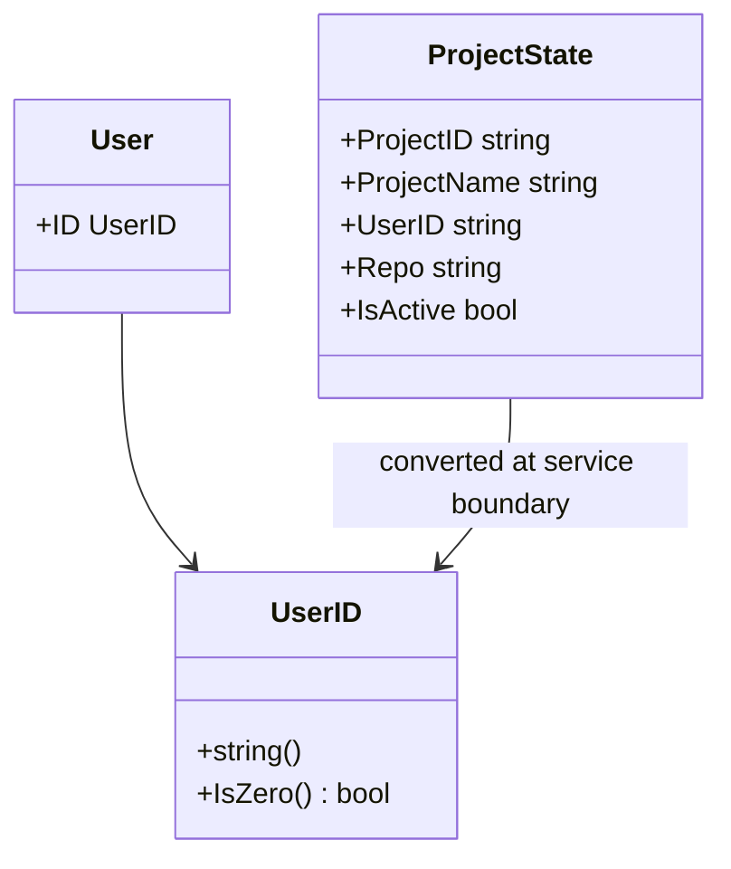
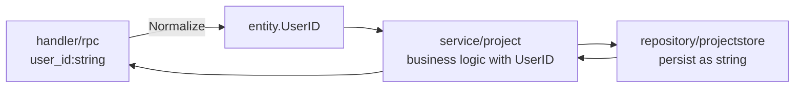

# Gateway Entities

This document summarizes the entity boundaries in `internal/gateway`.

## Goals

- Treat `user_id` as a meaningful `UserID` type, not just a raw string.
- Use entity types at the `handler -> service` boundary to clarify responsibilities.
- Keep repository persistence string-based for incremental migration.

## Current Entities

- `User`
  - Implementation: `internal/gateway/entity/user.go`
  - Identifier: `UserID`
  - Helpers: `NormalizeUserID`, `IsZero`, `DemoUserID`
- `Project`
  - Persisted shape is currently held by `projectstore.State`
  - `user_id` is converted to `UserID` at the `project.Service` boundary

## Structure Diagram

## Layer Flow

## Key Rules

- Always normalize RPC `user_id` using `entity.NormalizeUserID`.
- Public methods in `project.Service` should accept `entity.UserID`.
- Keep `projectstore` string-based for compatibility.
- Convert `UserID -> string` when returning proto responses.

## Future Extensions

- Add `User` repository/service and explicitly model `Project` ownership.
- Split `projectstore.State` into entity/DTO layers to remove persistence-model coupling from services.
