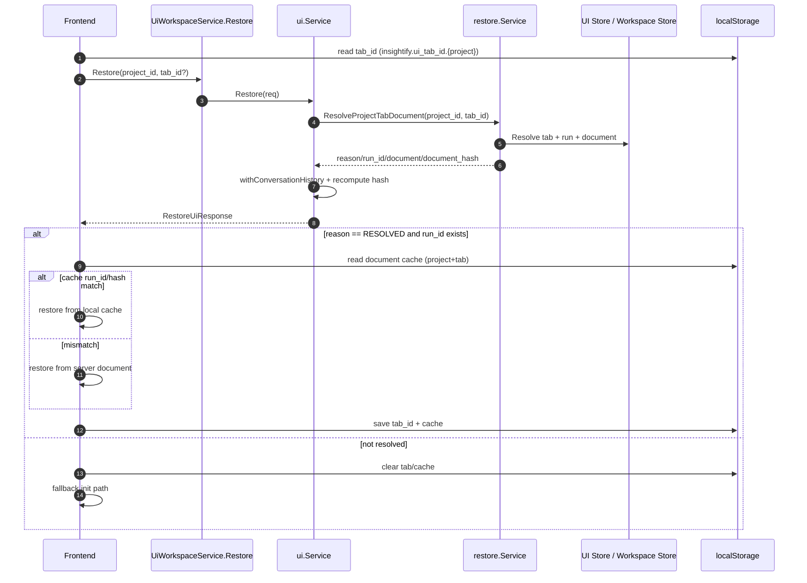

# UI Restore / Cache / ApplyOps Flow

## Scope

This document explains the current implementation of:

- `Restore` contract and resolution flow (Core + Frontend)
- Browser-side restore cache behavior
- Frontend `ApplyOps` batching and retry queue

Primary files:

- `schema/proto/insightify/v1/ui.proto`
- `InsightifyCore/internal/gateway/service/ui/service.go`
- `InsightifyCore/internal/gateway/service/restore/service.go`
- `InsightifyWeb/src/pages/home/useHomeBootstrapRunner.ts`
- `InsightifyWeb/src/pages/home/useUiRestoreCache.ts`
- `InsightifyWeb/src/features/ui/hooks/useUiEditor.ts`
- `InsightifyWeb/src/features/interaction/hooks/useInteractionFlow.ts`

## 1. Contract (Restore)

`RestoreUiResponse` is now **reason-first** (no backward-compat flags):

- `reason`: authoritative restore outcome
- `project_id`, `tab_id`, `run_id`
- `document`
- `document_hash`

See `schema/proto/insightify/v1/ui.proto` (`RestoreUiResponse`).

### Restore reason semantics

- `UI_RESTORE_REASON_RESOLVED`
  - valid `tab_id` / `run_id`
  - `document` may still have empty nodes
- `UI_RESTORE_REASON_NO_TAB`
  - target tab could not be resolved
- `UI_RESTORE_REASON_NO_RUN`
  - tab exists but no `run_id`
- `UI_RESTORE_REASON_ERROR`
  - reserved for internal error handling paths

## 2. Core restore behavior

Core restore is resolved in two layers:

- `ui.Service.Restore(...)`
  - validates request
  - calls restore domain service
  - enriches with conversation history
  - recomputes hash after enrichment
- `restore.Service.ResolveProjectTabDocument(...)`
  - resolves tab/run
  - loads `UiDocument`
  - sets `reason`
  - computes canonical hash

Hash function is `HashDocumentCanonical(...)`:

- deterministic protobuf marshal (`proto.MarshalOptions{Deterministic: true}`)
- sort key: `node.id`, then `node.type`, then encoded payload bytes
- SHA-256 over canonicalized stream

This means hash changes on structural/content changes, not only node IDs.

## 3. Frontend restore behavior

Restore entry point:

- `useHomeBootstrapRunner.restoreLatestTab(...)`

Steps:

1. Resolve preferred tab (`tab_id` from localStorage if not provided)
2. Call `UiWorkspaceService.Restore`
3. Accept restore only when `reason == UI_RESTORE_REASON_RESOLVED` and `runId` exists
4. Resolve source document via `useUiRestoreCache.resolveDocument(...)`
   - `server` document by default
   - `local_cache` only when `(runId, documentHash)` matches
5. Rebuild node UI from chosen document
6. Save tab id and document cache

Browser cache keys:

- active tab per project:
  - `insightify.ui_tab_id.{projectId}`
- document cache per project+tab:
  - `insightify.ui_doc_cache.{projectId}.{tabId}`

Cache payload:

- `runId`
- `documentHash`
- `document`
- `savedAt`

## 4. ApplyOps batching/retry behavior

`useUiEditor` manages **run-scoped queues**.

Per run (`run_id`), queue state:

- `version` (base version for ApplyOps)
- `queuedCalls`
- `retryBatch`
- `inFlight`
- `flushTimer`, `retryTimer`

Policy:

- batch window: `180ms`
- retry backoff: `300ms` exponential up to `2000ms`
- max retry attempts: `5`
- conflict (`res.conflict==true`) is retried using updated server version

Current wiring:

- `useInteractionFlow` builds a shadow `UiNode` per node id
- state transitions (user message, assistant message, responding) call `uiEditor.upsertNode(...)`
- `useHomeBootstrapRunner` seeds run-version via `setNodeRunId(nodeId, runId, doc.version)`

## 5. Mermaid diagrams

### 5.1 Restore flow



### 5.2 ApplyOps batching + retry

```mermaid
flowchart TD
  A[UI state change] --> B[useInteractionFlow updates shadow UiNode]
  B --> C[uiEditor.upsertNode(run_id, node)]
  C --> D[enqueue per-run queue]
  D --> E{flush timer active?}
  E -- no --> F[start 180ms timer]
  E -- yes --> D
  F --> G[merge queued ops into one batch]
  G --> H[ApplyOps(base_version=queue.version)]
  H --> I{success?}
  I -- yes --> J[update queue.version from document/currentVersion]
  J --> K[resolve queued promises]
  I -- conflict/network fail --> L{attempt < 5?}
  L -- yes --> M[retryBatch + exponential backoff]
  M --> H
  L -- no --> N[reject queued promises]
```

## 6. Invariants

- `reason` is the only restore decision signal for clients.
- `run_id` gates both restore acceptance and ApplyOps routing.
- Cache use is allowed only when `runId` and `documentHash` both match.
- ApplyOps queue is isolated by `run_id`.

## 7. Known limitations

- Current persistence wiring is focused on interaction-driven node updates.
- `UiLlmChatState` has no draft input field; unsent textarea text is not persisted.
- No explicit online/offline detector; retry relies on request failures/timeouts.

## 8. Operational checks

If restore behavior looks wrong:

1. Verify `RestoreUiResponse.reason` and `run_id` first.
2. Compare `document_hash` in response vs browser cache entry.
3. Confirm queue version progression (`currentVersion`/`document.version`).
4. Check for repeated max-retry failures in frontend error handling.
